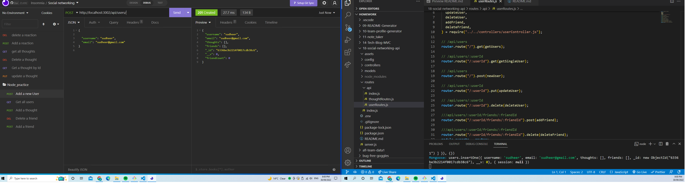
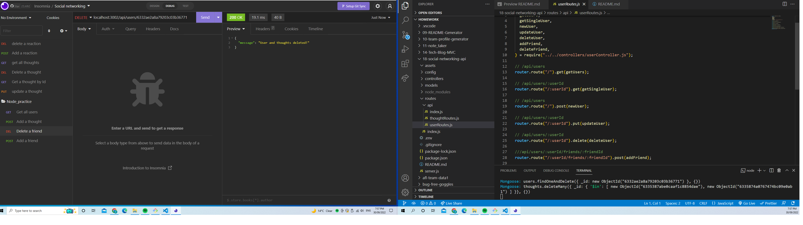
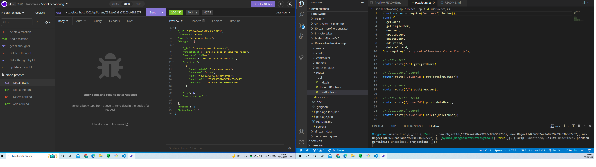
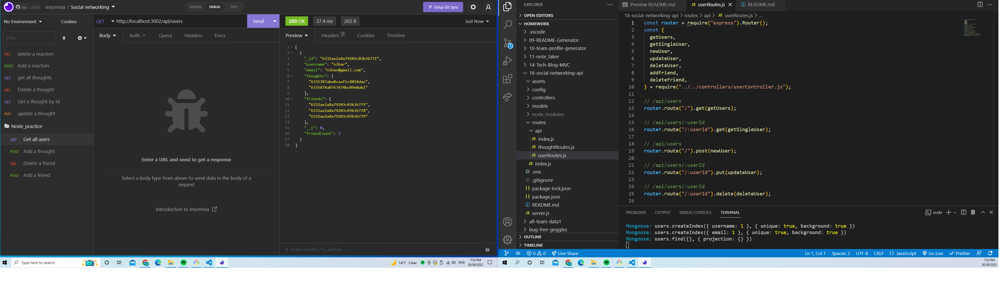
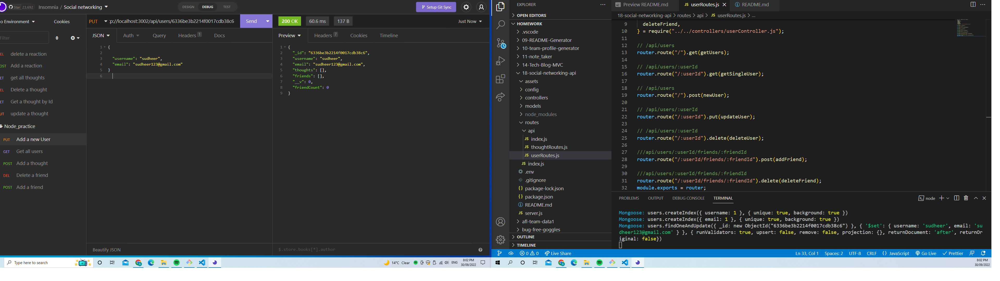

# 18-social-networking-api

## My Task

My Challenge is to build an API for a social network web application where users can share their thoughts, react to friends’ thoughts, and create a friend list. I used Express.js for routing, a MongoDB database, and the Mongoose ODM. In addition to using the [Express.js](https://www.npmjs.com/package/express) and [Mongoose](https://www.npmjs.com/package/mongoose) packages, I also used a JavaScript date library native JavaScript `Date` object to format timestamps.

## User Story

```md
AS A social media startup
I WANT an API for my social network that uses a NoSQL database
SO THAT my website can handle large amounts of unstructured data
```

## Acceptance Criteria

```md
GIVEN a social network API
WHEN I enter the command to invoke the application
THEN my server is started and the Mongoose models are synced to the MongoDB database
WHEN I open API GET routes in Insomnia for users and thoughts
THEN the data for each of these routes is displayed in a formatted JSON
WHEN I test API POST, PUT, and DELETE routes in Insomnia
THEN I am able to successfully create, update, and delete users and thoughts in my database
WHEN I test API POST and DELETE routes in Insomnia
THEN I am able to successfully create and delete reactions to thoughts and add and remove friends to a user’s friend list
```

## Mock Up

The following images show how my application routes are tested in insomnia:



delete a user by Id<br>


Get a user by Id<br>


Get all users<br>


Update a user by Id<br>


### API Routes

**`/api/users`**

- `GET` all users

- `GET` a single user by its `_id` and populated thought and friend data

- `POST` a new user:

- `PUT` to update a user by its `_id`

- `DELETE` to remove user by its `_id`

**BONUS**: Remove a user's associated thoughts when deleted.<br>
Delete route is also added

---

**`/api/users/:userId/friends/:friendId`**

- `POST` to add a new friend to a user's friend list

- `DELETE` to remove a friend from a user's friend list

---

**`/api/thoughts`**

- `GET` to get all thoughts

- `GET` to get a single thought by its `_id`

- `POST` to create a new thought (don't forget to push the created thought's `_id` to the associated user's `thoughts` array field)

```json
// example data
{
  "thoughtText": "Here's a cool thought...",
  "username": "lernantino",
  "userId": "5edff358a0fcb779aa7b118b"
}
```

- `PUT` to update a thought by its `_id`

- `DELETE` to remove a thought by its `_id`

---

**`/api/thoughts/:thoughtId/reactions`**

- `POST` to create a reaction stored in a single thought's `reactions` array field

- `DELETE` to pull and remove a reaction by the reaction's `reactionId` value

## deploymnet

[screencastifylink](https://drive.google.com/file/d/1vS4K9O1u8D5FiUFQrwQPH0-ZROgQTg5S/view)</br>
[github repo](sudheer313/18-social-networking-api)</br>
[github link](https://github.com/sudheer313/18-social-networking-api)</br>

## credits

askBCS </br>
referred week18-mvc mini project
referreed https://github.com/joce1ynn/social-network-NoSQL

## What I learned

This application helped me to understand how to create modeles in mongoose and create a connection to mongoose database create routes using express routes

## Challanges

At start I was unable to understand MongoDB. I was unbale to models and understand basic strcuture. But after careful understanding of concepts and class activities helped me to congigure this app.
I am also thankful to BCS who helped me through the process when I was struck in the due process of execution.

## Author

@Sudheer Kandula

© 2022 Trilogy Education Services, LLC, a 2U, Inc. brand. Confidential and Proprietary. All Rights Reserved.
